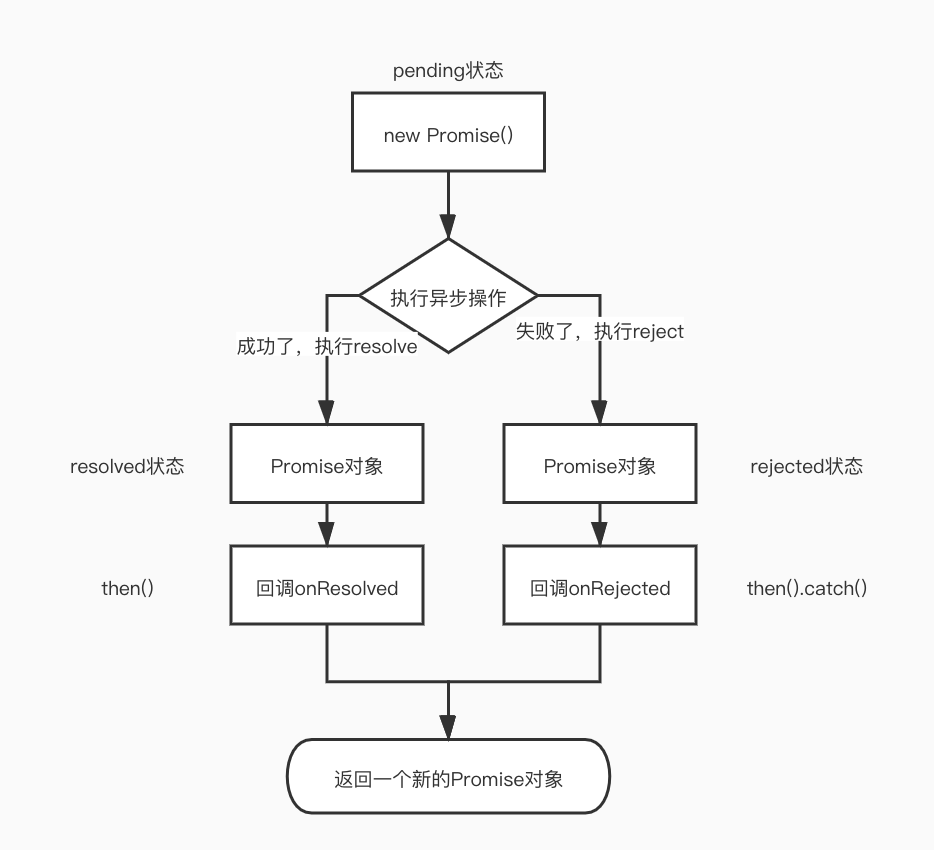

### Promise

#### Promise是什么？

1. 理解

   - 抽象表达：
     - Promise是一门新的技术（ES6规范）
     - Promise是JS中进行异步编程的新解决方案（旧方案是单纯使用回调函数）异步编程包括文件操作、数据库操作、Ajax、定时器等
   - 具体表达：
     - 从语法上来说：Promise是一个构造函数
     - 从功能上来说：Promise对象用来封装一个异步操作并可以获取其成功/失败的结果值

2. Promise的状态改变

   [[*PromiseState*]]代表状态，是Promise内置的属性

   状态类型：

   - pending:初始状态
   - resolved/fulfilled:成功
   - rejected:失败

   说明：状态改变只能变为成功和失败，且一个promise对象只能改变一次，无论变为成功还是失败，都会有一个结果数据

3. Promise对象的值

   Promise一共有两个内置属性[[*PromiseState*]] [[*PromiseResult*]]

   [[*PromiseResult*]] 保存着对象 成功/失败的值（value/reason），是Promise的另一个内置属性

   只能通过resolve和reject方法改变其值

4. Promise的基本流程

   

#### 为什么要用Promise？

1. 指定回调函数的方式更加灵活

   - 旧的：必须在启动异步任务前指定
   - promise：启动异步任务=》返回promise对象=》给promise对象绑定回调函数（甚至可以在异步任务结束后指定/多个）

2. 支持链式调用，可以解决回调地狱问题

   - 什么是回调地域？

     回调函数嵌套调用，外部回调函数异步执行的结果是嵌套的回调执行的条件

   - 回调地狱的缺点？

     不方便阅读

     不便于异常处理

   - 解决方案？

     promise链式调用

   - 终极解决方案？

     async/await

#### 如何使用Promise？

1. API

   - Promise构造函数：Promise(executor){}

     - executor函数：执行器(resolve,reject)=>{}
     - resolve函数：内部定义成功时我们调用的函数
     - reject函数：内部定义失败时我们调用的函数

     说明：executor会在Promise内部立即同步调用，异步操作在执行器中执行

   - Promise.prototype.then方法：(onResolved,onRejected)=>{}

     - onResolved函数：成功的回调函数
     - onRejected函数：失败的回调函数

     说明：指定用于得到成功的成功回调和得到失败的失败回调，返回一个新的Promise对象

   - Promise.prototype.catch方法：(onRejected)=>{}

     - onRejected函数：失败的回调函数

     说明：then的语法糖，相当于then(undefined,onRejected)

   - Promise.resolve方法：Promise.resolve(value)

     - value:将被Promise对象解析的参数，也可以是一个成功或失败的Promise对象
     - 返回值：返回一个带着一个给定值解析过的Promise对象，如果参数本身就是一个Promise对象，则返回这个Promise对象

   - Promise.reject方法：Promise.reject(reason)

     - reason:失败的原因，不论传什么值，返回的都是失败的结果，如果传入一个成功的Promise对象，结果也是失败的，失败的reason为传入的成功Promise

   - Promise.all方法：Promise.all(iterable)

     - iterable：包含n个Promise的可迭代对象，如Array和String

     说明：返回一个新的Promise，只有所有的promise都成功才成功，只要有一个失败直接返回失败

   - Promise.race方法：Promise.race(iterable)

     - iterable：包含n个Promise的可迭代对象，如Array和String

     说明：返回一个新的Promise，第一个完成的promise的结果状态就是最终的结果状态，谁先完成就输出谁（不论成功还是失败）

   - Promise.allSettled方法:Promise.race(iterable)

     - iterable：包含n个Promise的可迭代对象，如Array和String
     - 返回值：返回一个新的Promise，可以拿到每个promise的状态，不论是否成功

     ~~~javascript
     const p1 = Promise.reject('1');
     const p2 = Promise.resolve('2')
     const p3 = Promise.resolve('3');
     
     Promise.allSettled([p1,p2,p3]).then(res=>{
     //[{status: "rejected", reason: "1"}, {status: "fulfilled", value: "2"}, {status: "fulfilled", value: "3"}]
         console.log(res); 
     })
     ~~~

2. Promise的几个关键问题？

   - 如何改变promise的状态？

     - resolve(value)：如果当前是pending就会变为fulfilled/resolved
     - reject(reason):如果当前是pending就会变为rejected
     - 抛出异常

   - 一个promise指定多个成功/失败回调函数，都会调用吗？

     - 当promise状态改变为对应状态时都会调用

   - Promise.then()返回的新promise的结果状态由什么决定？

     - 由then()指定的回调函数执行的结果决定
     - 抛出一个异常throw，返回一个新的promise，状态为rejected，reason为返回的值
     - return一个非promise的任意值，新promise状态变为resolved，value为返回的值
     - 如果返回的是一个新的promise对象，此promise的结果就会成为新promise的结果

   - Promise如何串联多个任务？

     - promise的then方法返回一个新的promise，可以完成then方法的链式调用

   - Promise异常穿透？

     - 当使用promise的then链式调用时，可以在最后指定失败的回调
     - 前面任何操作出现了异常，都会传到最后的回调中处理

   - 中断Promise链？

     - 在then方法中返回一个pending状态的promise会中断promise链

     ~~~javascript
     let p = new Promise((resolve, reject) => {
         resolve('OK');
     })
     
     p.then(res=>{
         console.log(res);
         return new Promise((resolve, reject) => {});
     }).then(e=>{
         console.log(1111);
     }).then(e=>{
         console.log(2222);
     })
     //只会打印 OK 不会接着向下执行
     ~~~

   - catch方法最后调用，如果在Promise链中间返回了reject状态，会中断Promise链

     

