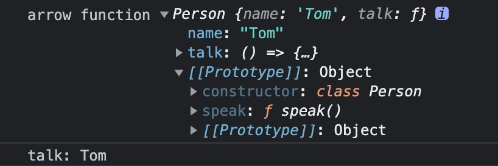
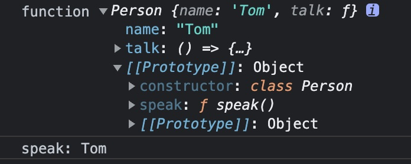
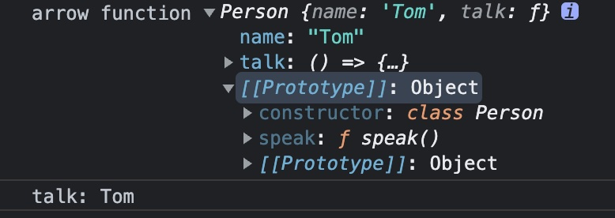
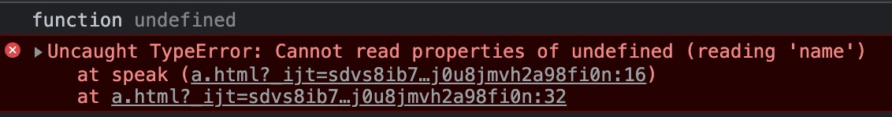

## class中的箭头函数和普通函数

### 前言

class是es6中的新语法，本质上并不是功能，只是对象原型的语法糖，让对象原型的写法更接近传统的面向对象语言。

### 示例代码

~~~javascript
class Person {
    constructor(name) {
        this.name = name;
    }

    speak() {
        console.log(this.name)
    }

    talk = () => {
        console.log(this.name)
    }
}

let p = new Person('Tom');
~~~

### 通过实例调用方法

- 调用箭头函数方法

~~~javascript
p.talk();
~~~

- 调用普通函数方法

~~~
p.speak();
~~~

### 小结

1. class中的方法如果是普通函数方法，该方法会绑定在构造函数的原型上；
2. 如果方法是箭头函数方法，该方法会绑定在构造函数上；
3. 通过上述方式调用class中的方法，无论是箭头函数还是普通函数，方法中的this都指向实例对象

### 通过方法的引用调用方法

- 调用箭头函数方法

~~~javascript
let talk = p.talk;
talk();
~~~

- 调用普通函数方法

~~~javascript
let speak = p.speak;
speak();
~~~

### 小结

1. 通过引用来调用箭头函数方法，方法中的this依然指向创建的实例对象

   原因：箭头函数中的this，只和定义该箭头函数的位置有关系，即箭头函数的this始终是该箭头函数所在作用域的this。而箭头函数所在的作用域中的this指向Person实例对象。

2. 通过引用来调用普通函数方法，方法中的this会指向undefined

   原因：普通函数中的this是动态绑定的，始终指向函数的执行环境，上面的例子中在全局环境中调用方法，但是this却是undefined而不是window。原因在于class声明和class表达式中会默认使用严格模式。