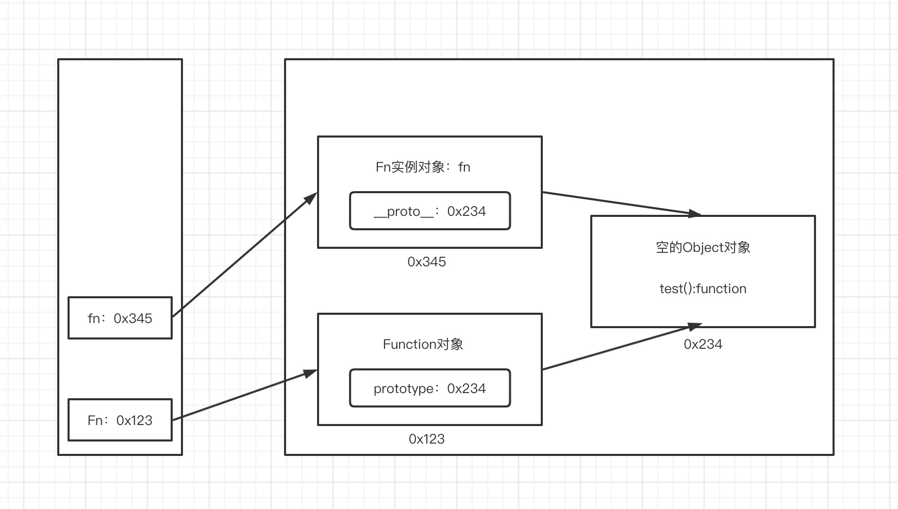
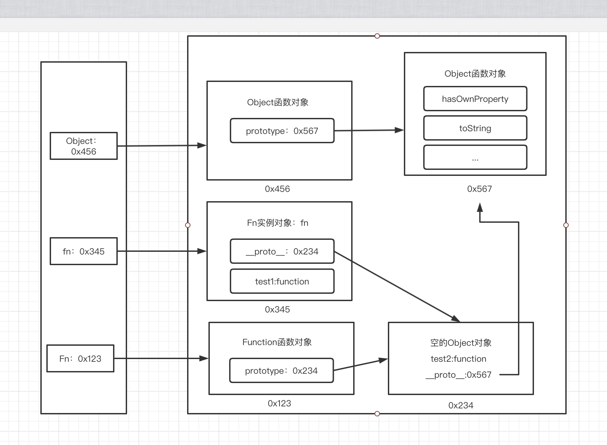

### 原型与原型链

[toc]

**重点！！！！！！**（一定要会画，和想明白）

#### prototype

1. 函数的prototype属性

   - 每个函数都有一个prototype属性，它默认指向一个Object空对象（即称为：原型对象）
   - 原型对象中有一个constructor属性，它指向函数对象

2. 给原型对象添加属性（一般都是方法）

   - 作用：函数的所有实例对象自动拥有原型中的属性（方法）

   ~~~javascript
   Function.prototype.constructor === Function // true
   ~~~

3. 属性问题

   - 读取对象属性值时：会自动到原型链中查找
   - 设置对象属性值时：不会查找原型链，如果当前对象没有此属性，直接添加属性并设置值
   - 方法一般定义在原型中，属性一般定义在对象中

4. 补充

   - 函数的显示原型指向的对象默认是空Object实例对象（Object除外）

     ~~~javascript
     function Fn(){}
     console.log(Fn.protoptype instanceof Object) // true
     console.log(Object.protoptype instanceof Object) // false
     console.log(Function.protoptype instanceof Object) // true
     ~~~

   - 所有的函数都是Function的实例（包括Function本身）

      ~~~javascript
      console.log(Function.prototype === Function.__proto__) //true
      ~~~

   - Object 的原型对象是原型链的尽头

     ~~~javascript
     // Object.prototype是最顶层
     console.log(Object.prototype.__proto__) // null 
     //Funtion.prototype是第二层
     Function.prototype.__proto__ === Object.prototype // true
     //其余构造函数都是底层
     (Object/Function/Array/...).__proto__ === Function.prototype //true
     ~~~

     

#### 显式原型和隐式原型

1. 每个函数function都有一个prototype，即显式原型
2. 每个实例对象都有一个\__proto__，即隐式原型
3. 实例对象的隐式原型为与其对应的构造函数的显式原型
4. 内存结构
5. 总结：
   - 函数的prototype属性：在定义函数时自动添加的，默认值是一个空的Object对象
   - 对象的\__proto__属性：创建对象时自动添加的，默认值为其构造函数的prototype属性值
   - 所有函数的\__proto__属性都是一样的

~~~javascript
function Fn() { // 内部语句 ：this.prototype = {};

}
// 每一个函数function都有prototype属性，即显式原型
console.log(Fn.prototype);
// 每一个实例对象都有__proto__属性
var fn = new Fn(); // 内部语句 ：this.__proto__ = Fn.prototype;

console.log(fn.__proto__);

console.log(Fn.prototype === fn.__proto__); // true
~~~

#### 原型链

1. 原型链（图解）
   - 访问一个属性时：
     - 先在自身属性中查找，找到返回
     - 如果没有，再沿着\__proto__这条链向上查找，找到返回
     - 如果最终没有找到，返回undefined
   - 别名：隐式原型连
   - 作用：查找对象的属性（方法）

~~~javascript
function Fn() {
    this.test1 = function () {
        console.log('test1')
    }
}

Fn.prototype.test2 = function () {
    console.log('test2')
}

var fn = new Fn();

fn.test1();
fn.test2();

console.log(fn.toString());
~~~

查找方法如下图所示，沿着\__proto__

 

#### 重点！！！！！！！！

#### 探索instanceof

1. instanceof是如何判断的？
   - 表达式：A instanceof B
   - 如果B函数的显式原型对象（prototype）在A对象的原型链（\__proto__）上，返回true，否则返回false
2. Function是通过new自己产生的