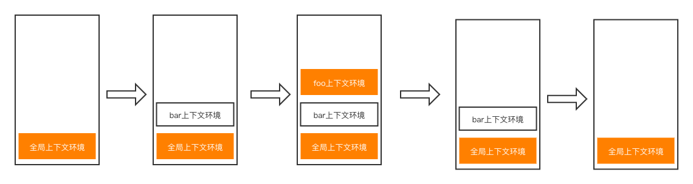

### 执行上下文与上下文栈

 ### 变量提升与函数提升

1. 变量声明提升
   - 通过var定义（声明）的变量，在定义语句之前就可以访问到
   - 值：undefined
2. 函数声明提升
   - 通过function声明的函数，在之前就可以直接调用
   - 值：函数定义（对象）

~~~javascript
var a = 3;
/**
 涉及到变量提升和作用域问题
 fn执行的代码其实是这样：
 var a;
 console.log(a);
 a = 5;
 */
function fn() {
    console.log(a);
    var a = 5;
}

fn(); // undefined

console.log(b); // undefined

fn2(); // fn2()

fn3();// 报错 Uncaught ReferenceError: Cannot access 'fn3' before initialization

function fn2() {
    console.log('fn2()');
}

let fn3 = function (){
    console.log('fn3()')
}

var b = 10;
~~~

#### 执行上下文

1. 代码分类（位置）
   -  全局代码
   - 函数（局部）代码
2. 全局执行上下文
   - 在执行全局代码前将window确定为全局执行上下文（虚拟的，存于栈中）
   - 对全局数据进行预处理
     - var定义的全局变量==>undefined，添加为window的属性
     - function声明的全局函数==>赋值fn()，添加为window的属性
     - this==>赋值window
3. 函数执行上下文
   - 在调用函数，准备执行函数体之前，创建相应的函数执行上下文对象
   - 对局部数据进行预处理
     - 形参变量==>赋值（实参）==>添加为执行上下文的属性
     - arguments==>赋值（实参列表）==>添加文执行上下文的属性

~~~javascript
//全局执行上下文
console.log(a1); // undefined

a2(); // a2()

console.log(this); // window:{}

var a1 = 3;

function a2(){
    console.log('a2()');
}

console.log(a1); // 3
~~~

### 执行上下文栈

1. 理解
   - 在全局代码执行前，JS引擎就会创建一个栈来存储管理所有的执行上下文对象
   - 在全局执行上下文（window）确定后，将其添加到栈中（入栈）
   - 在函数执行上下文创建后，将其添加到栈中（入栈）
   - 在当前函数完成后，将栈顶的对象移除（出栈）
   - 当所有的代码执行完后，栈中只剩下window

2. 图示

   ~~~javascript
   var a = 10;
   //1.进入全局执行上下文
   var bar = function (x){
       var b = 5;
       foo(x + b); // 3.进入foo执行上下文
   }
   
   var foo = function (y){
       var c = 5;
       console.log(a + c + y);
   }
   
   bar(10);// 2.进入bar函数执行上下文
   ~~~

   

#### 总结：

- 执行上下文对象最多有N+1个，N为调用函数的次数
