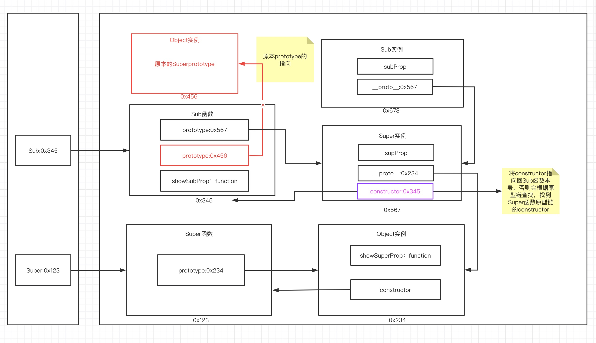

### 继承模式

1. 原型链继承

   - 过程

     - 定义父类型构造函数
     - 给父类型的原型添加方法
     - 定义子类型的构造函数
     - 创建父类型的对象赋值给子类型的原型
     - 让子类型原型的constructor指向子类型
     - 给子类原型添加方法
     - 创建子类型的对象：可以调用父类型的方法

   - 关键

     - 子类型的原型为父类型的一个实例对象
     - 用来继承方法

     ```javascript
     function Super(){
         this.supProp = 'Supper property';
     }
     
     Super.prototype.showSuperProp = function (){
         console.log(this.supProp);
     }
     
     function Sub(){
         this.subProp = 'sub property';
     }
     
     //子类型的原型为父类型的一个实例对象
     Sub.prototype = new Super();
     //子类型的原型的constructor指向子类型 如果没有这一步 子类型原型的constructor会指向父类型
     Sub.prototype.constructor = Sub;
     
     Sub.prototype.showSubProp = function (){
         console.log(this.subProp)
     }
     
     var sub = new Sub();
     
     sub.showSubProp();
     ```

     

2. 借用构造函数继承（假的）

   - 过程

     - 定义父类型构造函数
     - 定义子类型构造函数
     - 在子类型构造函数中调用父类型构造

   - 关键

     - 在子类型构造函数中使用super()调用父类型构造函数
     - 并没有继承，只是简化了写法

     ```javascript
     function Person(name,age){
         this.name = name;
         this.age = age;
     }
     
     function Student(name,age,grade){
         Person.call(this,name,age);//相当于this.Person(name,age) ，但是不可以直接调用，因为实例对象并没有Person方法，所以通过call来借用
         //this.name = name; //相当于这两行代码
         // this.age = age;
         this.grade = grade;
     }
     ```

3. 组合继承

   - 原型链+借用构造函数组合继承

   - 利用原型链实现对父类型对象的方法继承

   - 利用super()借用父类型构造函数初始化相同属性

     ```javascript
     function Person(name,age){
         this.name = name;
         this.age = age;
     }
     
     Person.prototype.setName = function (name){
         this.name = name;
     }
     
     function Student(name,age,grade){
         Person.call(this,name,age);//相当于this.Person(name,age) ，但是不可以直接调用，因为实例对象并没有Person方法，所以通过call来借用
         //this.name = name; //相当于这两行代码
         // this.age = age;
         this.grade = grade;
     }
     
     Student.prototype = new Person();
     
     Student.prototype.constructor = Student;
     
     let stu = new Student('张三',12,4);
     
     stu.setName('李四');
     
     console.log(stu);
     ```

