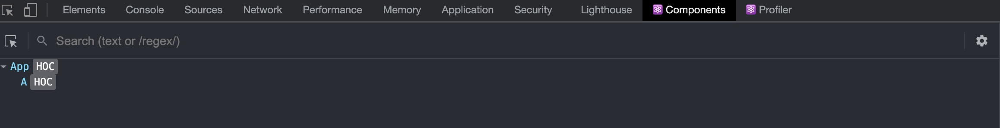

### React中的高阶组件 HOC

关键词：高阶函数 高阶组件 属性代理 反向继承 装饰器

最近有个需求要在每个页面里加入统一的埋点，一开始想的是写一个基础的类组件，让所有的组件都去继承这个组件，在父组件中做埋点的操作，但是在React官网看到[组合vs继承](https://react.docschina.org/docs/composition-vs-inheritance.html)，原文是**React有十分强大的组合模式。我们推荐使用组合而非继承来实现组件间的重用。**所以打算用组合方式来做，这里就要涉及到下面的高阶组件的内容

[TOC]

> 文章原文：[React Higher Order Components in depth](https://medium.com/@franleplant/react-higher-order-components-in-depth-cf9032ee6c3e)

#### 什么是高阶组件？

在了解高阶组件之前 可以先了解一下什么是高阶函数 因为高阶组件与高阶函数概念非常相似

> 如果一个函数接受一个或多个函数作为参数或者返回一个函数就可以称之为高阶函数

下面就是一个简单的**高阶函数**

~~~javascript
function withGreeting(greeting = ()=>{}){
		return greeting;
}

withGreeting(function (){
    console.log(1111)
})();
~~~

**高阶组件**的定义和**高阶函数**非常相似

> 如果一个函数接受一个或多个组件作为参数并返回一个组件就可成为**高阶组件**
>
> **一个高阶组件只是**包装了另一个React组件的React组件

这种形式通常实现为一个函数，本质上是一个类工厂（class factory）

~~~
hocFactory:W:React.Component => E:React.Component
~~~

这里的W(WrappedComponent)指被包装的React.Component,E(Enhanced Component)指返回的新的高阶React组件

定义中的「包装」一词故意被定义的比较模糊 因为它可以指定两件事情：

1. 属性代理（Props Proxy）：高阶组件操控传递给WrappedComponent的props
2. 反向继承（Inheritance Inversion）：高阶组件继承WrappedComponent

#### 我可以用高阶组件做什么？

概括地讲，高阶组件允许你做：

- 代码复用，逻辑抽象，抽离底层准备代码
- 渲染劫持
- State抽象和更改
- Props更改

在探讨这些东西的细节之前，我们先学习如何实现一个高阶组件，因为实现方式「允许/限制」你可以通过高阶组件做哪些事情

#### 高阶组件工厂的实现

在这节中我们将学习两种主流的在React中实现高阶组件的方法：属性代理（Props Proxy）和反向继承（Inheritance Inversion）。两种方法囊括了几种包装WrappedComponent的方法。

### Props Proxy

属性代理的实现方法如下：

~~~javascript
function ppHoc(WrappedComponent){
    return class PP extends React.Component{
        render() {
            return (
                <WrappedComponent {...this.props}/>
            );
        }
    }
}
~~~

这里高阶组件的render方法返回了一个type为WrappedComponent的React Element，我们把高阶组件收到的props传递给它，因此得名Props Proxy。

~~~javascript
<WrappedComponent {...this.props}/>
//相等
React.createElement(WrappedComponent,this.props,null);
~~~

#### Props Proxy可以做什么？

- 更改props
- 通过refs获取组件实例
- 抽象state
- 把WrappedComponent与其他的Elements包装在一起

#### 更改props

你可以「**读取，添加，修改，删除**」，将要传递给WrappedComponent的props。

在编辑和删除重要的props要注意，你可能需要给高阶组件的props指定命名空间防止破坏了从外面传递给WrappedComponent的props

~~~
function ppHoc(WrappedComponent){
    return class PP extends React.Component{
        render() {
            const newProps = {
                user:currentLoggedInUser
            }
            return (
                <WrappedComponent {...this.props} {...newProps}/>
            );
        }
    }
}
~~~

#### 通过refs获取组件实例

你可以通过ref获取关键词this(WrappedComponent的实例)，但是想要它生效，必须先经过一次正常的渲染过程来让ref得到计算，这意味着你需要在高阶组件的render方法中返回WrappedComponent,让React进行reconciliation流程，然后你就拥有了一个WrappedComponent的ref实例

例子：在下面的例子中 我们实现了通过ref去获取实例并且执行实例的方法

~~~javascript
function refsHOC(WrappedComponent) {
  return class RefsHOC extends React.Component {
    proc(wrappedComponentInstance) {
      wrappedComponentInstance.method()
    }
    
    render() {
      const props = Object.assign({}, this.props, {ref: this.proc.bind(this)})
      return <WrappedComponent {...props}/>
    }
  }
}
~~~

当WrappedComponent被渲染后，ref上的回调函数proc将会被执行，此时就拥有了这个wrappedComponent的实例的引用，这个可以用来「读取，添加」实例的props或用来执行实例的方法

也可以通过传统ref来获取到wrappedComponent实例

~~~javascript
function refsHoc(WrappedComponent) {
    return class PP extends React.Component {

        constructor(props) {
            super(props);
            this.componentRef = React.createRef();
        }

        componentDidMount() {
            console.log(this.componentRef);
        }

        render() {
            return <WrappedComponent {...this.props} {...this.state} ref={this.componentRef}/>;
        }
    }
}
~~~

通过这种方式也可以获取到WrappedComponent实例

#### 抽象state

你可以通过向WrappedComponent传递props和callbacks来抽象state，这个React中的另一个组件构成思想[dumb and smart components](https://medium.com/@dan_abramov/smart-and-dumb-components-7ca2f9a7c7d0#.o2qmm6j3h)非常相似

例子：在下面这个抽象state的例子中，我们幼稚的抽象除了input的value和onChange。之所以说幼稚是因为这样写并不常见，但是你会理解这样的写法。

~~~javascript
function ppHOC(WrappedComponent) {
  return class PP extends React.Component {
    constructor(props) {
      super(props)
      this.state = {
        name: ''
      }
      this.onNameChange = this.onNameChange.bind(this)
    }
    onNameChange(event) {
      this.setState({
        name: event.target.value
      })
    }
    render() {
      const newProps = {
        name: {
          value: this.state.name,
          onChange: this.onNameChange
        }
      }
      return <WrappedComponent {...this.props} {...newProps}/>
    }
  }
}
~~~

然后这样使用它：

~~~javascript
@ppHOC
class Example extends React.Component {
  render() {
    return <input name="name" {...this.props.name}/>
  }
}
~~~

这里的input变成了一个受控组件

把WrappedComponent与其他elements包装在一起

出于操作样式、布局或其他目的，你可以将WrappedComponent与其他组件包装在一起。一些基本的用法也可以使用正常的父组件来实现，但是就像之前所描述的，使用高阶组件你可以获得更多的灵活性。

例子：包装来操作样式

~~~javascript
function ppHOC(WrappedComponent) {
  return class PP extends React.Component {
    render() {
      return (
        

          <WrappedComponent {...this.props}/>
        

      )
    }
  }
}
~~~

### Inheritance Inversion（II）

反向继承 可以像这样简单地实现：

~~~javascript
function iiHOC(WrappedComponent) {
  return class Enhancer extends WrappedComponent {
    render() {
      return super.render()
    }
  }
}
~~~

如你所见，返回的高阶组件类Enhancer继承了WrappedComponent，这被叫做反向继承是因为WrappedComponent被动的被Enhancer继承，而不是WrappedComponent去继承Enhancer。通过这种方式他们之间的关系倒转了。

反向继承允许高阶组件通过this关键字获取WrappedComponent，意味着它可以获取到state，props，组件生命周期钩子，以及渲染方法（render）。

#### Reconciliation 过程

介绍之前先来总结一些理论。

React Element 在React执行它的reconciliation的过程时描述什么将被渲染。

React Element可以使两个种类其中的一种：String或Function。String类型的React Element代表原生DOM节点，Function类型的React Element代表通过React.Component创建的组件。

Function类型的React Element将在reconciliation阶段被解析成DOM类型的React Element（最终结果一定都是DOM元素）。

这点非常重要，这意味着「反向继承的高阶组件不保证一定解析整个子元素数」。这对渲染劫持非常重要。

#### 可以用反向继承高阶组件做什么？

- 渲染劫持
- 操作state

##### 渲染劫持

它被叫做渲染劫持是因为高阶组件控制了WrappedComponent生成的渲染结果，并且可以做各种操作。

通过渲染劫持你可以：

- 「读取、添加、修改、删除」任何一个将被渲染的React Element的props

- 在渲染方法中读取或更改React Elements tree，也就是WrappedComponent的children

- 根据条件不同，选择性的渲染子树

- 给子树里的元素变更样式

- 渲染指的是WrappedComponent.render方法

  > 你无法更改或创建props给WrappedComponent实例，因为React不允许变更一个组件收到的props，但是你可以再render方法里更改子元素/子组件们的props。 

就像之前所说的，反向继承的高阶组件不能保证一定渲染整个子元素树，这同时也给渲染劫持添加了一些限制。通过反向继承，你只能继承WrappedComponent渲染的元素，这意味着如果WrappedComponent的子元素里有Function类型的React Element，你不能劫持这个元素里面的子元素树的渲染。

例子1：条件性渲染。如果this.props.loggedIn是true，这个高阶组件会原封不动地渲染WrappedComponent，如果不是true则不渲染（假设此组件会受到loggedIn的prop）

~~~javascript
function iiHOC(WrappedComponent) {
  return class Enhancer extends WrappedComponent {
    render() {
      if (this.props.loggedIn) {
        return super.render()
      } else {
        return null
      }
    }
  }
}
~~~

例子2：通过render来变成React Elements tree的结果

~~~javascript
function iiHOC(WrappedComponent) {
    return class Enhancer extends WrappedComponent {
        render() {
            const elementsTree = super.render();
            console.log(elementsTree)
            let newProps = {};
            if(elementsTree && elementsTree.type === 'input'){
                newProps = {value : 'may the force be with u'}
            }
            const props = Object.assign({},elementsTree.props,newProps);
            const newElementsTree = React.cloneElement(elementsTree,props,elementsTree.props.children);
            return newElementsTree;
        }
    }
}
~~~

在这个例子里，如果WrappedComponent的顶层元素是一个input，则改变它的值为'may the force be with u'。

这里你可以做任何操作，比如你可以遍历整个element tree 然后变更某些元素的props。

> 注意：你不能通过Props Proxy来做渲染劫持
>
> 即使你可以通过WrappedComponent.prototype.render获取它的render方法，你需要自己手动模拟整个实例以及生命周期方法，而不是依靠React，这是不值当的，应该使用反向继承来做到渲染劫持。要记住React在内部处理组件的实例，而你只能通过this或refs来处理实例。

##### 操作state

高阶组件可以「读取、修改、删除」WrappedComponent实例中的state，如果需要也可以添加新的state。需要记住的是，你在弄乱WrappedComponent的state，可能会导致破坏一些东西。通常不建议使用高阶组件来读取或添加state，添加state需要使用命名空间来防止与WrappedComponent的state冲突。

例子：通过显示WrappedComponent的props和state来debug

~~~javascript
export function IIHOCDEBUGGER(WrappedComponent) {
  return class II extends WrappedComponent {
    render() {
      return (
        

          <h2>HOC Debugger Component</h2>
          
Props
 <pre>{JSON.stringify(this.props, null, 2)}</pre>
          
State
<pre>{JSON.stringify(this.state, null, 2)}</pre>
          {super.render()}
        

      )
    }
  }
}
~~~

##### 命名

当通过高阶组件来包装一个组件时，你会丢失原先WrappedComponent的名字，可能会给开发和debug造成影响

反向继承时，被继承的组件的名字会被修改

常见的解决方案是在原先的WrappedComponent的名字前面添加一个前缀。下面这个方法是从React-Redux中拿来的。

~~~javascript
HOC.displayName = `HOC(${getDisplayName(WrappedComponent)})`
//or
class HOC extends ... {
  static displayName = `HOC(${getDisplayName(WrappedComponent)})`
  ...
}
~~~

方法getDisplayName被如下定义：

~~~javascript
function getDisplayName(WrappedComponent) {
  return WrappedComponent.displayName || 
         WrappedComponent.name || 
         ‘Component’
}
~~~

 现在来总结一下父组件能做和不能做的事情（与高阶组件对比）：

- 渲染劫持
- 操作内部props
- 抽象state。但是有缺点，不能在父组件外获得到它的state，除非明确地实现了钩子
- 与新的React Element包装。这似乎是唯一一点，使用父组件要比高阶组件强，但高阶组件也同样可以实现
- children的操控，如果children不是单一root，则需要多添加一层来包括所有children，可能会使你的markup变得有点笨重。使用高阶组件可以保证单一root。
- 父组件可以在元素随意使用，它们不像高阶组件一样限制于一个组件。

通常来讲，能使用父组件达到的效果，尽量不要用高阶组件，因为高阶组件是一种更hack的方法，但同时也有更高的灵活性。
