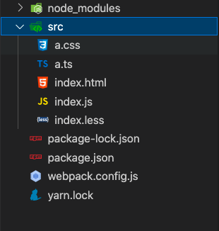

## webpack基础配置

- 安装本地webpack

- webpack webpack-cli -D

  <u>注意webpack和包的版本 版本可能导致包的引用报错</u>

## webpack可以进行0配置

- 打包工具 -> 输出后的结果(js模块)
- 打包 支持js的模块化
- 默认生成dist目录

## 手动配置webpack

- 默认配置文件的名字 webpack.config.js

执行webpack打包命令：npx webpack

```javascript
//webpack 是node写出来的node语法

const path = require('path');

module.exports = {
    mode:'',//模式 development production
    entry:'./src/index.js',// 入口
    output: {
        path: path.resolve(__dirname, 'dist'),//路径必须为绝对路径
        filename: '[hash].bundle.js' //打包后的文件名
      },
  };
```


项目目录结构:


